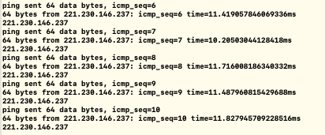

# HDPingTools
 
### [中文文档](#chinese)

### [Document for English](#english)




## pod安装

```
pod 'HDPingTools'
```

## introduce

<span id = "english"></span>

Although the 'AF networking' and 'alamofire' provide the function of detecting the mobile network, they only know the user's network connection mode, but do not know the user's real user experience. Although the user is connected to WiFi, the network speed is not as fast as 3G network. Therefore, as long as it is not a disconnection condition, the real network speed when a user initiates a request is more important.

So it encapsulates this function. You can ping the requested domain name through this project to get the return time and judge whether the user network is in the normal range.

The package is based on Apple's [SimplePing](https://developer.apple.com/library/archive/samplecode/SimplePing/Introduction/Intro.html#//apple_ref/doc/uid/DTS10000716) and optimized again, which makes it easier to use and can be called in three steps
 
###1. Create a ping object with the hostname as the user-defined domain name

```
let pingTools = HDPingTools(hostName: "www.apple.com")
```

###2. Start Ping


```
pingTools.start(pingType: .any, interval: 1) { (response, error) in
      print(response?.pingAddressIP ?? "")
 }
```

When  `interval` is greater than 0, Ping requests will be sent repeatedly at fixed intervals. When `interval` is equal to 0, only one ping request will be sent

The `response` of the response contains the following contents

* `pingAddressIP` is the IP address corresponding to the domain name
* `responseTime` ping the response time
* `responseBytes` Response bytes

###3. Stop request

```
pingTools.stop()
```

`pingTools.isPing`can judge whether there is a task in progress

<span id = "chinese"></span>

## 中文介绍

虽然在`AFNetworking`和`Alamofire`中，提供的有检测手机网络的功能，但是只是知道了用户的网络连接方式，并不清楚用户的真实用户体验，可能用户虽然连接的是wifi，但是网速还不如3G网络。所以只要不是断网条件，用户发起请求时的真实网速更重要。

所以就封装了这个功能，可以通过该项目去`ping`一下请求的域名，以便得到返回的时间，去判断用户网络是否在正常范围。

该功能是基于苹果封装的[SimplePing](https://developer.apple.com/library/archive/samplecode/SimplePing/Introduction/Intro.html#//apple_ref/doc/uid/DTS10000716)再次进行封装优化，使用更加简单，三步即可调用

### 1、创建ping对象，hostName为自定义的域名

```
let pingTools = HDPingTools(hostName: "www.apple.com")
```

### 2、发起ping

```
pingTools.start(pingType: .any, interval: 1) { (response, error) in
      print(response?.pingAddressIP ?? "")
 }
```
`interval`大于0时，会在固定间隔重复发送ping请求，等于0时只会发起一次ping请求

其中响应的`response`包含了以下内容

* `pingAddressIP` 域名对应的ip地址
* `responseTime` ping响应的时间
* `responseBytes` ping响应的字节数

### 3、关闭请求

```
pingTools.stop()
```

`pingTools.isPing`可以判断当前是否有任务在进行中
