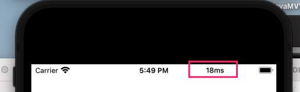

# DDPingTools

This is an iOS platform for Ping tools, using swift language development. Support the use of cocoapods integration. It can be used in three steps

### [中文文档](https://ddceo.com/blog/1296.html)

| log | iPhone X状态栏 statusBar |  状态栏 statusBar |
|----|----|----|
|||

## introduce

<span id = "english"></span>

Although the `AFNetworking` and `alamofire` provide the function of detecting the mobile network, they only know the user's network connection mode, but do not know the user's real user experience. Maybe the user is connected to WiFi, but the network speed is not as fast as 3G network. 

So it encapsulates this function. You can ping the requested domain name through this project to get the return time and judge whether the user network is in the normal range.

The package is based on Apple's [SimplePing](https://developer.apple.com/library/archive/samplecode/SimplePing/Introduction/Intro.html#//apple_ref/doc/uid/DTS10000716) and optimized again, which makes it easier to use and can be called in three steps

## CocoaPods

```
pod 'DDPingTools'
```
 
### 1. Create a ping object with a hostname

```
let pingTools = DDPingTools(hostName: "www.apple.com")
```

### 2. Start Ping


```
pingTools.start(pingType: .any, interval: .second(10)) { (response, error) in
      print(response?.pingAddressIP ?? "")
 }
```

When  `interval` is greater than 0, Ping requests will be sent repeatedly at fixed intervals. When `interval` is equal to 0, only one ping request will be sent

The `response` of the response contains the following contents

* `pingAddressIP` is the IP address corresponding to the domain name
* `responseTime` ping the response time
* `responseBytes` Response bytes

### 3. Stop request

```
pingTools.stop()
```

### 4、Optional configuration

```
public var timeout: HDPingTimeInterval = .millisecond(1000)  //user defined timeout. The default value is 1000 ms. if it is set to 0, it will wait all the time
public var debugLog = true                                  //enable log output
public var stopWhenError = false                            //stop Ping when an error is encountered
public private(set) var isPing = false				//you can judge whether there is a ping task in progress
public var showNetworkActivityIndicator: NetworkActivityIndicatorStatus = .auto              //Whether to display in the status bar
```


**Note: if the website or connected router is set to prohibit Ping, an error will be reported when pinging. You need to remove the restriction before you can use it normally**